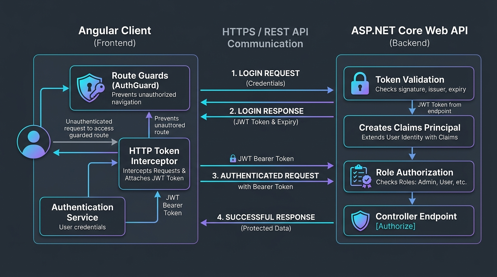

#  Enterprise Clean Architecture Blueprint: ASP.NET Core & Modern Patterns
[](https://dotnet.microsoft.com/)
[](https://docs.microsoft.com/en-us/dotnet/csharp/)
[](https://docs.microsoft.com/ef/core/)
[](#architectural-overview)
[](LICENSE)
> A production-grade enterprise architecture blueprint demonstrating **Clean (Onion) Architecture**, **Decoupled Data Access**, **Preventing Entity Leakage (DTO Projections)**, and preparing enterprise codebases for **.NET 8 advancements**.
---
##  Architectural Overview (Separation of Concerns)
The solution adheres strictly to Clean Architecture principles, enforcing unidirectional dependency flow towards the core domain:
              ┌───────────────────────────────┐
              │          API Layer            │
              │  (Controllers, DTOs, Mappings)│
              └───────────────┬───────────────┘
                              │
                              ▼
              ┌───────────────────────────────┐
              │    Infrastructure Layer       │
              │  (EF Core, Repositories, SQL) │
              └───────────────┬───────────────┘
                              │
                              ▼
              ┌───────────────────────────────┐
              │          Core Layer           │
              │  (Entities, Domain Contracts) │
              └───────────────────────────────┘
1. **Core Layer (Domain):** Contains pure domain entities (`ServiceApp`, `Category`, `CustomerReview`, `User`) and abstract repository interfaces (`IServiceAppRepository`). Completely decoupled from external frameworks and persistence details.
2. **Infrastructure Layer:** Implements data persistence using **Entity Framework Core**, database context configurations (`SkillDbContext`), and migration lifecycles.
3. **API Presentation Layer:** Exposes versioned REST endpoints, enforces JWT authentication policies, and strictly mediates all inputs and outputs using **Data Transfer Objects (DTOs)**.
---
##  Enterprise Engineering Patterns Implemented
### 1. Zero Entity Leakage (DTO Encapsulation)
Direct exposure of EF Core entities across HTTP boundaries leads to mass-assignment vulnerabilities, tight coupling, and circular serialization references.
- **DTO Separation:** Every request and response has an explicit contract (`ServiceAppDto`, `ServiceAppDtoRequest`, `CustomerReviewRespondDto`).
- **Automated Mapping:** Centralized AutoMapper profile profiles (`AutoMapperProfiles.cs`) ensure high-performance, strongly typed mapping between domain models and DTOs.
### 2. Eliminating the N+1 Query Dilemma
In relational data access, fetching navigation properties in iterative loops causes cascading database round-trips:
- Optimized using **Eager Loading (`.Include()`)** combined with explicit projections, executing a single optimized SQL `JOIN`.
- Read-only operations leverage **`.AsNoTracking()`** to bypass the EF Core change tracker, cutting memory allocations and reducing Garbage Collection (GC) pauses under load.
### 3. Identity & Full-Stack Token Security
- Integrated **ASP.NET Core Identity** for secure password hashing (PBKDF2 with HMAC-SHA256).
- Stateless **JWT Bearer Authentication** with cryptographically signed tokens and fine-grained Role-Based Access Control (Admin, Writer, Reader).
- **Angular 18 SSR Pass-Through:** Eliminates authentication flickering during Server-Side Rendering via decoupled execution checks (isPlatformServer).
- **Defensive Error Handling:** Global middleware sanitizes exceptions, preventing sensitive stack traces or database schema disclosures.
- 📖 **Full Architectural Specification:** Read the [Complete Security Architecture Guide](SECURITY_ARCHITECTURE.md).


---
##  Architectural Evolution: .NET 7 vs. .NET 8 Considerations
As modern backend engineering evolves, this blueprint highlights key technical advantages when transitioning enterprise solutions from **.NET 7** to **.NET 8**:
| Architectural Feature | Implementation in .NET 7 (Current) | Evolution in .NET 8 / C# 12 | Engineering Impact |
| :--- | :--- | :--- | :--- |
| **Dependency Injection** | Standard constructor injection with verbose private readonly fields. | **Primary Constructors (`C# 12`)** directly on class definitions. | Eliminates ~60% of boilerplate code across controllers and services. |
| **Service Resolution** | Manual Factory Pattern needed for multiple interface implementations. | **Keyed Services (`[FromKeyedServices]`)** built natively into the DI container. | Simplified swapping of multi-tenant repositories or caching strategies. |
| **EF Core Query Pipeline** | Complex `IN` predicates executed with moderate allocation overhead. | **Primitive Collections support** and optimized SQL translation. | Drastic query execution speedup and lower allocation footprint. |
| **Time Abstraction** | Reliance on `DateTime.UtcNow` makes unit-testing token expiry difficult. | **`TimeProvider` abstraction** natively supported across ASP.NET Core. | Bulletproof, deterministic unit testing of temporal token logic. |
---
## Getting Started
### Prerequisites
- [.NET 7.0 SDK](https://dotnet.microsoft.com/download/dotnet/7.0) (or higher)
- [SQL Server](https://www.microsoft.com/en-us/sql-server/) / LocalDB
- Visual Studio 2022 / VS Code
### Installation & Run
```bash
# 1. Clone the showcase blueprint
git clone https://github.com/fetouri/ISkill-Enterprise-Architecture.git
# 2. Navigate to project root
cd ISkill-Enterprise-Architecture
# 3. Restore dependencies & build
dotnet restore
dotnet build
# 4. Run the API
dotnet run --project API
 Author & Architecture Contact
Elfetouri Zidan
Full-Stack Software Engineer (.NET Core & Angular)

LinkedIn: linkedin.com/in/elfetouri-zidan (Update with your direct profile)
Email: 

elfitouri.zd@gmail.com
